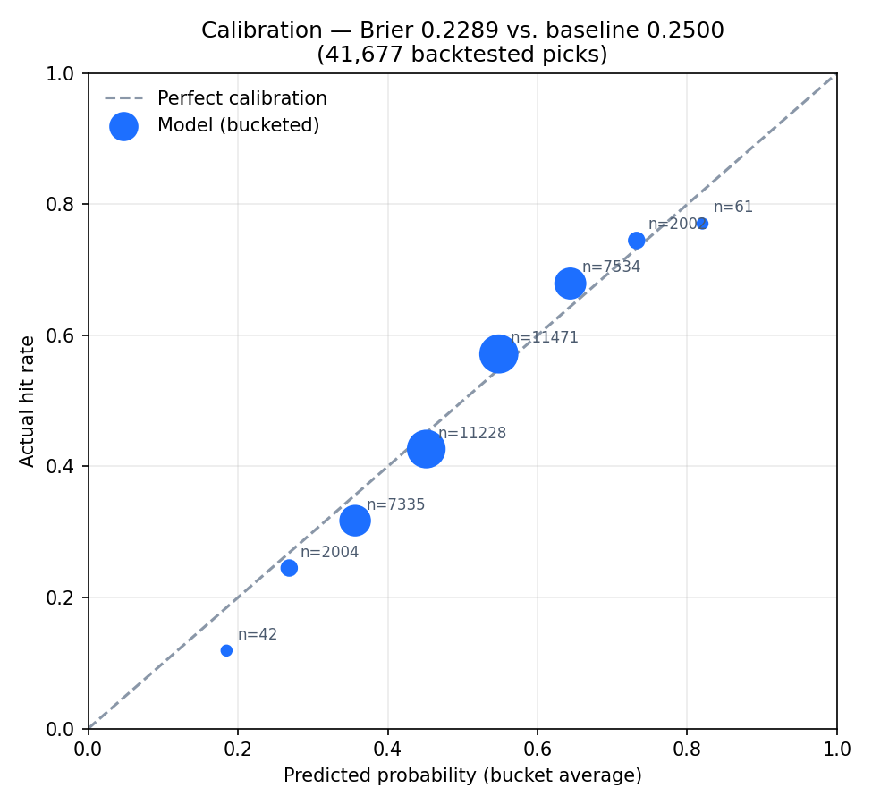

# Nabil's Prop Analyzer — methodology & validation

A short, portfolio-facing summary of what this project does, how it
estimates a probability, and how that estimate was validated — for the
full technical documentation, see `README.md`.

## What it does

Given an NBA player, a stat (points, rebounds, assists, steals,
blocks, or points+rebounds+assists), a line, and an opponent, the
model estimates the probability the player's stat lands over or under
that line — for a single prop, a multi-prop parlay on one player, or a
same-game parlay across multiple players on both teams. It's built on
a SQLite schema populated either from a bundled synthetic demo dataset
or from real box scores pulled via the free `nba_api` package, and is
deployed as a Streamlit web app as well as a CLI.

## The model

Three inputs feed a normal-distribution probability estimate:

1. **A recency-weighted average of the player's own recent games**,
   using exponential decay (`weight = 0.5 ** (games_ago / half_life)`,
   half-life of 8 games by default) so a hot or cold last two weeks
   moves the estimate more than a game from a month ago, without
   discarding the rest of the season's signal entirely.
2. **A matchup adjustment**, comparing what the opponent allows to
   players at that position against the league average for that
   position — a team-level proxy for "how tough is this defense,"
   since individual-defender data isn't available in the free data
   source this project uses.
3. **A home/away adjustment**, applied only when there's enough of a
   sample (5+ games) at that split to trust it.

The combined mean and standard deviation feed a normal-distribution
probability calculation (with a continuity correction, since these are
discrete counting stats), giving `P(stat >= line)`.

## Validation: point-in-time backtesting

A probability estimate is only useful if it's honest about its own
confidence — a pick rated "70%" should hit roughly 70% of the time
across many picks, not just sound confident. `scripts/backtest.py`
checks this directly, and does it the way a real forecasting backtest
has to: it replays every game in chronological order, and at each
point only uses information that existed *before* that date — both
the player's trailing form and every team's defensive stats are
computed from history-so-far, never from the future. This avoids the
common backtesting mistake of leaking future information into a
"prediction" of the past, which would make any model look better than
it actually is. Since real historical betting lines aren't available,
each test case uses the player's own trailing average as a synthetic
"fair line," with over/under assigned at random (seeded, so it's
reproducible) — this tests whether the model's confidence is honest
in general, not whether a specific sportsbook's line is beatable.

## What backtesting found, and what got fixed

Three real issues surfaced and were fixed through this same
loop — run the backtest, read the calibration table, fix what it
shows, re-run:

- **Flooring the standard deviation** — a hyper-consistent short
  recent stretch was producing an unrealistically tight (and
  overconfident) spread. Effect was modest; this wasn't the main
  problem.
- **Dampening the matchup-defense adjustment** — the raw team-vs-
  league ratio was swinging the estimate more than it should have;
  blending it partway back toward neutral (the same technique already
  used for the home/away adjustment) closed most of an overconfidence
  gap.
- **Shrinking the recency-weighted mean toward the full-season mean**,
  in proportion to how many recent games actually back up that
  estimate (an empirical-Bayes-style blend). After the first two
  fixes, predictions below 50% were still running a few points low and
  predictions above 50% a few points high relative to actual outcomes
  — the signature of "regression to the mean," where a hot or cold
  recent stretch partially reverts. The recency-weighted mean wasn't
  accounting for that the way the other two adjustments already had
  been dampened to.

On the bundled synthetic demo dataset, the current model scores a
Brier score of **0.2281** against a **0.2500** baseline (always
guessing 50%) across roughly 41,700 backtested picks, with
well-populated probability buckets landing within a couple of
percentage points of perfect calibration:

Each point is one probability bucket (e.g. "60-70% predicted"); its
size reflects how many picks fell in that bucket. A perfectly
calibrated model sits exactly on the dashed diagonal — a bucket of
picks the model called "60% likely" hitting exactly 60% of the time.

The synthetic generator doesn't necessarily reproduce the exact
hot-streak/regression dynamics of real NBA players, so this chart is
a demonstration of the validation *process*, not a claim about
real-world performance — the real test happens by running the backtest
on real fetched data. That's a deliberate design choice: the project
ships with a synthetic dataset so it's fully runnable and testable
with zero setup or API keys, while `scripts/fetch_data.py` swaps in
real players and real games through the exact same schema when you
have internet access to pull them.

**What actually happened testing this against real data — including a
negative result, because that's part of an honest validation
process.** Re-running the backtest against real fetched data (both
loaded seasons merged, ~164,000 backtested picks — a much larger,
messier sample than the synthetic demo set) surfaced a real bug: the
backtest's synthetic "fair line" was computed from the model's raw
(unshrunk) trailing average while the probability was computed from
the shrunk one, a mismatch that mimics real miscalibration without
being any. That bug alone produced a Brier score barely beating the
0.5-baseline (0.2469) and 54.2% directional accuracy. Fixing it —
anchoring the line to the same estimate the probability actually comes
from — moved the real number to 0.2467 and 54.1% accuracy:
**essentially unchanged.**

That's the more interesting finding than it sounds. It means the
shrinkage fix this section describes above — despite being a
theoretically sound, standard technique (empirical-Bayes shrinkage
toward regression-to-the-mean) — barely moved the needle on real data,
same as it barely moved it on the synthetic set. A modest calibration
gap remains in the real, well-populated buckets: predictions still run
a few points more extreme than what actually happens. Rather than
reach for a fourth hand-tuned constant against this one dataset (the
exact overfitting risk already flagged once in this project), that gap
is left open and named as a roadmap item — worth investigating with
real evidence (does it vary by season, by stat, by std estimate) before
guessing at another fix. The live app's own predictions were never
affected by any of this — a real prediction's line always comes from
the prop you type in, not the model's own estimate — this only affects
how much to trust the app's stated confidence level at the margins.

## Known limitations

- No individual-defender data — the matchup adjustment is a team-level
  position proxy, not "how does this player perform against this
  specific primary defender."
- No injury/rotation awareness — a player who's about to see reduced
  minutes doesn't get flagged.
- Regular season only — playoff games aren't included in the
  backtested calibration or the live estimates.
- The normal-distribution approximation is a reasonable fit for
  points/rebounds/assists but a rougher one for low-count stats like
  blocks and steals, where a Poisson-style distribution would likely
  fit better.

See `README.md`'s **Roadmap** section for where these are headed.

## Skills demonstrated

SQL schema design (season-scoped views, collision-safe multi-season
merging), point-in-time backtesting methodology, statistical modeling
(exponential decay weighting, empirical-Bayes-style shrinkage,
dampened ratio adjustments, normal-approximation probability with a
continuity correction), Python ETL (a real API → CSV → SQLite
pipeline with defensive header-compatibility checks), a tested CLI and
Streamlit web app sharing one core engine, and unit + backtest-based
validation rather than eyeballing a few outputs and calling it done.
